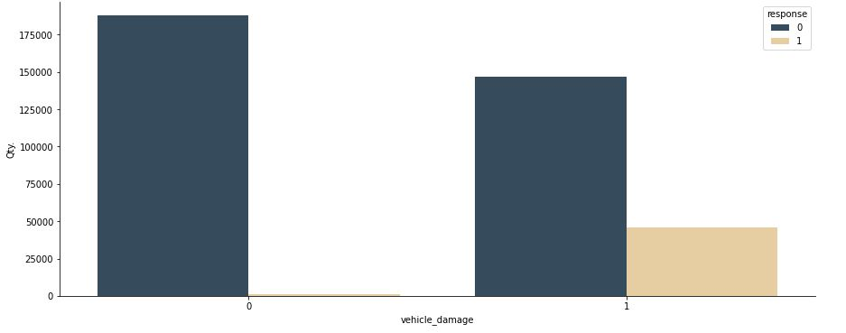
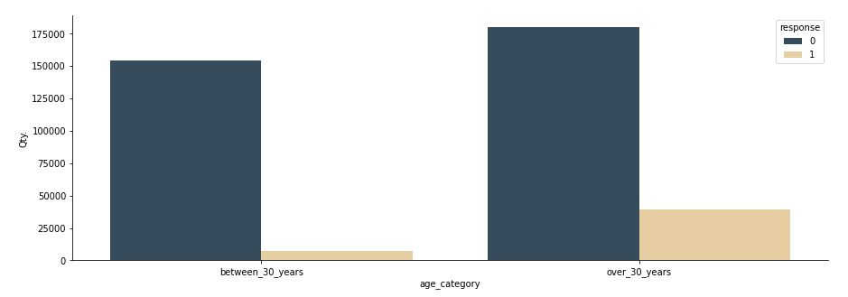
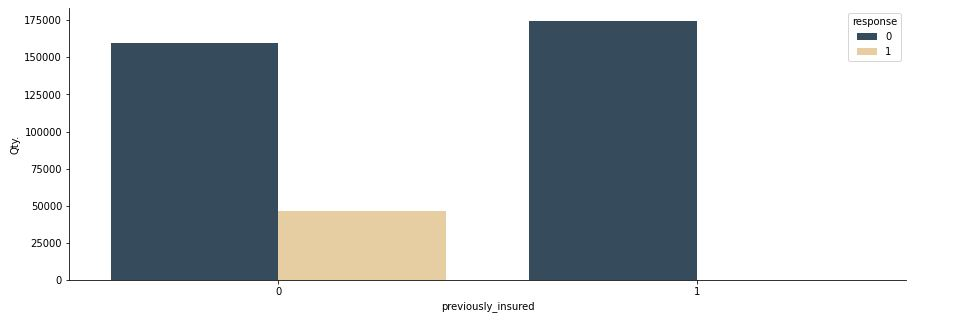
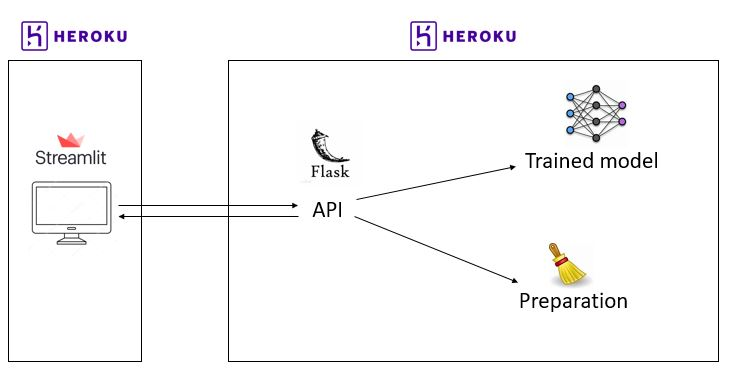
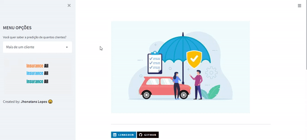

# Health-Insurance-Cross-sell

    

Previsão de interesse em um seguro de automóvel.

  

# Conteúdo

<!--ts-->

1.  [Contexto do Problema](Contexto-do-Problema)
2.  [O Problema](O-Problema)
3.  [Entendimento do Problema](Entendimento-do-Problema)
4.  [Dados](Descrição-de-Dados)
5.  [Planejamento da Solução](Planejamento-da-Solução)
6.  [Hipóteses Principais](Hipóteses-Principais)
7.  [Algoritmos ML](Algoritmos-de-Machine-Learning-Aplicados)
8.  [Performace Modelos](Performace-dos-Modelos-de-Machine-Learning)
9.  [Resultados](Resultados)
10. [Entrega da Solução](#Entrega-da-Solucao)

<!--te-->

# Contexto do Problema

A **Insurance All** é uma empresa que fornece seguro de saúde para seus clientes e o time de produtos está analisando a possibilidade de oferecer aos assegurados, um novo produto: Um seguro de automóveis.

Assim como o seguro de saúde, os clientes desse novo plano de seguro de automóveis precisam pagar um valor anualmente à Insurance All para obter um valor assegurado pela empresa, destinado aos custos de um eventual acidente ou dano ao veículo.

A Insurance All fez uma pesquisa com cerca de 380 mil clientes sobre o interesse em aderir a um novo produto de seguro de automóveis, no ano passado. Todos os clientes demonstraram interesse ou não em adquirir o seguro de automóvel e essas respostas ficaram salvas em um banco de dados junto com outros atributos dos clientes.

O time de produtos selecionou 127 mil novos clientes que não responderam a pesquisa para participar de uma campanha, no qual receberão a oferta do novo produto de seguro de automóveis. A oferta será feita pelo time de vendas através de ligações telefônicas.

Contudo, o time de vendas tem uma capacidade de realizar 20 mil ligações dentro do período da campanha.

# O Problema

Nesse contexto, você foi contratado como um consultor de Ciência de Dados para construir um modelo que prediz se o cliente estaria ou não interessado no seguro de automóvel.

Com a sua solução, o time de vendas espera conseguir priorizar as pessoas com maior interesse no novo produto e assim, otimizar a campanha realizando apenas contatos aos clientes mais propensos a realizar a compra.

Como resultado da sua consultoria, você precisará entregar um relatório contendo algumas análises e respostas às seguintes perguntas:

1. Principais Insights sobre os atributos mais relevantes de clientes interessados em adquirir um seguro de automóvel.

2. Qual a porcentagem de clientes interessados em adquirir um seguro de automóvel, o time de vendas conseguirá contatar fazendo 20.000 ligações?

3. E se a capacidade do time de vendas aumentar para 40.000 ligações, qual a porcentagem de clientes interessados em adquirir um seguro de automóvel o time de vendas conseguirá contatar?

4. Quantas ligações o time de vendas precisa fazer para contatar 80% dos clientes interessados em adquirir um seguro de automóvel?

# Entendimento do Problema

**Motivação:**

- A empresa vai realizar uma campanha para um novo produto (seguro de automóvel).

**Causa Raiz do Problema:**

- Identificar clientes com maior interesse no seguro do automóvel.

**Dados para Resolver o Problema:**

- Os dados estão armazenados em um banco de dados PostgresSQL na AWS

**Formato da Solução:**

- **Granularidade:** Previsão da probabilidade de compra por cliente.
- **Tipo de Problema:** Previsão da probabilidade de compra.
- **Potênciais Métodos:** Ranqueamento, Classificação.
- **Formato da Entrega:** WebApp Streamlit.

# Descrição de Dados

O Dataset usado para este projeto possui 381109 linhas e 12 colunas. Os dados contém:

| Atributo           | Significado                                                                               |
| ------------------ | ----------------------------------------------------------------------------------------- |
| id                 | Unique ID for the customer                                                                |
| Gender             | Gender of the customer                                                                    |
| Age                | Age of the customer                                                                       |
| Driving_License    | 0 : Customer does not have DL, 1 : Customer already has DL                                |
| Region_Code        | Unique code for the region of the customer                                                |
| Previously_Insured | 1 : Customer already has Vehicle Insurance, 0 : Customer doesn't have Vehicle Insurance   |
| Vehicle_Age        | Age of the Vehicle                                                                        |
| Vehicle_Damage     | 1 : Customer got his/her vehicle damaged. 0 : Customer didn't get his/her vehicle damaged |
| Annual_Premium     | The amount customer needs to pay as premium in the year                                   |
| PolicySalesChannel | iAnonymized Code for the channel of outreaching to the customer ie.                       |
| Vintage            | Number of Days, Customer has been associated with the company                             |
| Response           | Customer is interested, 0 : Customer is not interested                                    |

# Planejamento da Solução

**1. Descrever os Dados:**

- Coletar os dados no banco de dados, entender as variáveis disponíveis e verificar possíveis valores faltantes e inconsistências.
- Realizar uma estatística descritiva para entender as características dos dados.

**2. Levantar Hipóteses:**

- Criar Hipóteses sobre as características e o comportamento dos clientes interessados no produto.
- Realizar um Feature Engineering para criar novas variáveis.

**3. Filtrar Dados:**

- Filtrar linhas e colunas de acordo com as restrições de negócio e com as premissas assumidas.

**4. Realizar Análise Exploratória de Dados:**

- Validar ou refutar as hipóteses através dos dados.
- Identificar correlação entre variáveis e a variável resposta.
- Obter insights.

**5. Preparar os dados**

- Fazer o reescalonamento das variáveis e aplicar Encoding.

**6. Selecionar as melhores Features**

- Usar o algoritmo Random Forest para selecionar as features mais importantes.

**7. Modelagem de Machine Leaning**

- Treinar, aplicar cross validation nos algoritmos e validar a partir de métricas apropriadas e curvas de desempenho.

**8. Ajustar os Hiperparametros**

- Encontrar a melhor combinação de parametros para o modelo final usando a técnica de Grid Search.

**9. Traduzir e Interpretar o erro**

- Transformar a performace de Machine Leaning para resultado de Negócio, respondendo as perguntas de negócio feitas.

**10. Deploy do Modelo em Produção**

- Deixar o modelo acessível utilizando API e com acesso via webApp.

# Hipóteses Principais

### H4. Pessoas que nunca sofreram danos no automóvel estão interessadas em contratar um seguro.

**FALSA** Pessoas que possuem automóvel <ins>com dano</ins>, possuem maior interesse em contratar um seguro.

  

### H5. Pessoas com idade maior que 30, estão interessadas em contratar um seguro.

**VERDADEIRA** Pessoas com idade maior que 30 anos, estão mais interessadas em contratar um seguro do que pessoas com idade menor que 30.

  

### H8. Pessoas que já possuiram seguro em algum momento da vida, estão mais interessados em contratar o seguro da Insurance All.

**FALSA** Pessoas que <ins>nunca</ins> possuiram seguro em algum momento da vida, estão mais interessados em contratar o seguro da Insurance All.

  

# Algoritmos de Machine Learning Aplicados

Os modelos treinados foram:

- kNN
- Logistic Regression
- Random Forest
- XGBoost
- Naive Bayes

O modelo com performance mail alta e escolhido para resolver o problema da Insurance All foi o **XGBoost**.

# Performace dos Modelos de Machine Learning

As métricas usadas para comparação dos resultados foram: Precision top k (Precision @k), Recall topk (Recall @k), curva lift e curva acumulativa de ganho. Os resultados das performaces obtidas com a validação cruzada foram:

| Model Name          | precision_top_20000 | recall_top_20000 |
| ------------------- | ------------------- | ---------------- |
| XGBoost             | 0.247528            | 0.984839         |
| Random Forest       | 0.246628            | 0.981417         |
| Naive Bayes         | 0.246258            | 0.979945         |
| KNN                 | 0.245968            | 0.978990         |
| Logistic Regression | 0.243308            | 0.967132         |

# Resultados

## Respondendo Perguntas do Negócio

### 1. Principais Insights sobre os atributos mais relevantes de clientes interessados em adquirir um seguro de automóvel.

- Pessoas com idade maior que 30 anos, são mais interessadas em contratar um seguro.
- Pessoas que possuem automóvel com dano, possuem maior interesse em contratar um seguro.
- Pessoas que NUNCA possuiram seguro em algum momento da vida, estão mais interessadas em contratar um seguro.

### 2. Qual a porcentagem de clientes interessados em adquirir um seguro de automóvel, o time de vendas conseguirá contatar fazendo 20.000 ligações?

- Ranqueando a lista de 100 mil clientes para 20 mil ligações, o time de vendas conseguirá atingir <ins>58%</ins> dos interessados.

### 3. E se a capacidade do time de vendas aumentar para 40.000 ligações, qual a porcentagem de clientes interessados em adquirir um seguro de automóvel o time de vendas conseguirá contatar?

- Aumentando a capacidade para 40 mil ligações, o time de vendas conseguirá atingir <ins>92%</ins> dos interessados.

### 4. Quantas ligações o time de vendas precisa fazer para contatar 80% dos clientes interessados em adquirir um seguro de automóvel?

- Para conseguir atingir 80% dos interessados, o time de vendas precisa realizar <ins>31 mil</ins> ligações.

# Entrega da Solução

## Arquitetura Modelo em Produção

  

## Demonstração do Modelo

Acesse os resultados do modelo em produção [aqui](https://streamlit-car-insurance.herokuapp.com/)

  

